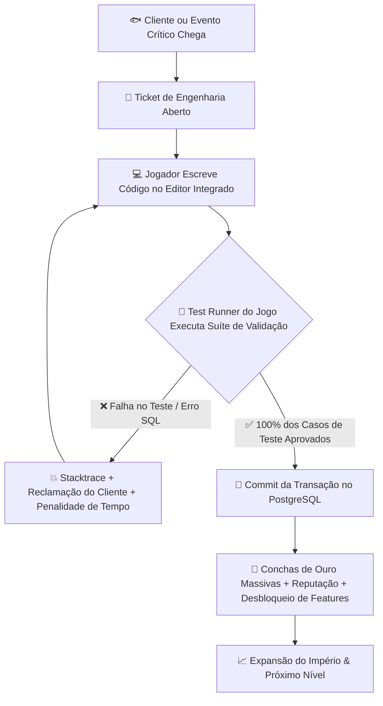
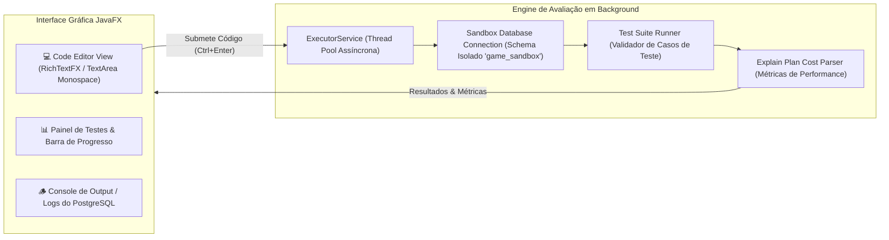

# 🍍 PRD: BIKINI BOTTOM CODE TYCOON & POSTGRESQL EMPIRE
## Documento de Requisitos de Produto (Product Requirements Document) — Edição Definitiva de Engenharia & Gameplay

---

## 1. VISÃO GERAL DO PRODUTO (EXECUTIVE SUMMARY)

* **Nome Oficial:** *Siri Cascudo OS: O Grande Desafio Dev da Fenda do Biquíni (Bikini Bottom Code Tycoon & PostgreSQL Empire)*
* **Gênero:** Software Engineering Sim / Coding Tycoon / PostgreSQL RPG / Action Restaurant Simulator
* **Inspirações:** *Shenzhen I/O, TIS-100, Overcooked, Restaurant Tycoon 2 (Roblox), Dave the Diver, Bitburner, Hacknet*
* **Plataforma:** JavaFX (JDK 25 LTS) + PostgreSQL 16/17 nativo
* **Filosofia Central:** **"Não é um jogo de ficar clicando à toa: aqui você é o Engenheiro de Software e DBA Chefe do Siri Cascudo."**
  * Para ganhar Conchas de Ouro (🐚), subir de nível e expandir o império gastronômico de Eugene H. Siriguejo, o jogador precisa **programar de verdade**.
  * A aplicação combina a estética retrô cômica dos anos 2000 do Bob Esponja com desafios reais e rigorosos de programação: consultas SQL com agregações complexas, triggers em PL/pgSQL, tuning de índices B-Tree contra gargalos de latência, sanitização contra ataques de injeção cibernética do Plankton e controle de concorrência com travas transacionais (`FOR UPDATE`).

---

## 2. A HISTÓRIA & SITUAÇÃO-PROBLEMA NARRATIVA

### 2.1. O Caos Tecnológico no Fundo do Mar
É o ano 2000 na Fenda do Biquíni. O Sr. Siriguejo percebeu que anotar pedidos em cadernos de papel mofados estava causando prejuízos milionários: pedidos duplicados, picles esquecidos e conchas sumindo misteriosamente da gaveta. Para cortar custos, ele comprou um computador monstro de tubo cinza rodando o obscuro **Bikini Bottom OS 2000** e instalou uma instância do banco de dados **PostgreSQL**.

### 2.2. A Equipe do Siri Cascudo
* **Lula Molusco (Atendimento/Frontend):** Recusa-se veementemente a digitar se o sistema tiver qualquer lag ou bug. Se uma consulta demorar mais de 800ms, ele cruza os braços, toca clarinete desafinado e os clientes vão embora xingando.
* **Bob Esponja (Cozinha/Worker):** Cozinheiro prodígio de coração puro, mas depende cegamente de uma fila de tarefas no banco (`order_queue`). Se a query de inserção quebrar ou a transação falhar por deadlock, Bob fica paralisado em pânico dizendo *"Estou pronto... para chorar!"*.
* **Seu Siriguejo (Stakeholder/CEO Avarento):** Exige relatórios financeiros diários em tempo real, pune severamente qualquer desperdício de memória e só libera gorjetas em conchas se o código passar 100% nas regras fiscais.
* **Sheldon J. Plankton (Vilão/Black-Hat Cracker):** Montou no Balde de Lixo o *Chum Cyber Warfare Labs*. Sabendo que o Siri Cascudo virou digital, Plankton envia scripts maliciosos de SQL Injection (`' OR 1=1 --`), explora race conditions para roubar hambúrgueres grátis e tenta dropar as tabelas de estoque.

---

## 3. DESIGN VISUAL, IDENTIDADE RETRÔ & EXPERIÊNCIA SENSORIAL ("JUICE")

### 3.1. Estética Visual: "Anos 2000 Submarino"
```
+-----------------------------------------------------------------------------------------+
| [O] Siri Cascudo OS 2000 - [Terminal DBA & Fritura Ativa]                      [_][#][X] |
+-----------------------------------------------------------------------------------------+
| ⏰ 12:45 PM | 🐚 1.450 Conchas (+45/s) | 🪼 CPU DB: 24% | 🍔 Pedidos em Fila: 3         |
+-----------------------------------------------------------------------------------------+
| [🔥 Chapa Ativa] [💻 Editor IDE SQL] [🐟 Atender Clientes] [🛡️ Firewall] [💥 Resetar]   |
+-----------------------------------------------------------------------------------------+
| +-------------------------+ +---------------------------------------------------------+ |
| | [LULA MOLUSCO - CAIXA]   | | [TERMINAL DE ENGENHARIA & IDE SUBMARINA]                | |
| |                         | | Desafio: "Relatório de Almoço do Siriguejo"             | |
| | "Escreva a query logo,  | | [1] SELECT category, COUNT(*), SUM(price::numeric)     | |
| |  meu expediente acaba   | | [2] FROM spongebob_items GROUP BY category              | |
| |  às cinco!"             | | [3] HAVING COUNT(*) >= 2 ORDER BY SUM DESC;             | |
| |                         | | [ ▶ EXECUTAR TESTES ] [ ⚡ EXPLAIN ANALYZE ]           | |
| +-------------------------+ +---------------------------------------------------------+ |
| +-------------------------------------------------------------------------------------+ |
| | [CONSOLE DE COMPILAÇÃO & TEST RUNNER]: 3/3 Testes Passaram! +250 🐚 CONCHAS! (24ms)   | |
| +-------------------------------------------------------------------------------------+ |
| +-------------------------------------------------------------------------------------+ |
| | 🏖️ AREIA DA FENDA (MINI-GAME): [Gary 🐌 --->]   [🍍 Bob Esponja Flutuando no Topo]  | |
+-----------------------------------------------------------------------------------------+
```

### 3.2. Paleta de Cores e Tipografia
* **Cores de Interface Retrô:**
  * Amarelo Queijo Esponja: `#ffeb3b` / Dourado Siri: `#fbc02d`
  * Azul Fenda Profunda (Bordas de Janela): `#0288d1` / `#01579b`
  * Cinza Escuro de Terminal: `#1a1a24` / Fundo de Código: `#0d1117`
  * Verde Sucesso de Query: `#00e676` / Vermelho Erro de Sintaxe: `#ff1744`
  * Areia da Fenda: `#ffe082` com granulação náutica
* **Tipografia:**
  * Títulos e Badges: *Krabby Patty Bold* / *Comic Sans MS* estilizada dos anos 2000.
  * Editor de Código e Logs do DB: *JetBrains Mono* / *Courier New* monospace de alta legibilidade com suporte a syntax highlighting.

### 3.3. Fator "Sensory Juice" & Resposta Tátil
* **Feedback de Código Compilado com Sucesso:**
  * O terminal emite o som característico de miado feliz do Gary (`gary_meow.mp3`).
  * Uma cascata de números dourados (`+250 🐚`) sobe com efeito elástico (*squash and stretch*) na tela.
  * O medidor de estresse do Lula Molusco diminui e Bob Esponja dá um salto mortal de 360 graus no `GlobalOverlayPane`.
* **Feedback de Erro de Sintaxe ou Teste Quebrado:**
  * Toca instantaneamente a buzina clássica cômica do desenho (`spongebob-fail.mp3` ou `spongebob-boowomp.mp3`).
  * A janela do terminal vibra sutilmente (*screen shake* de 4 pixels por 150ms).
  * O console exibe a linha exata do erro com stacktrace detalhado e uma citação ácida do Lula Molusco (*"Eu sabia que não devíamos ter contratado um molusco sem cérebro"*).

---

## 4. O SISTEMA DE DESAFIOS DE PROGRAMAÇÃO (CORE GAMEPLAY)

O jogador não progride apenas fritando hambúrgueres. Os grandes saltos de receita, novas filiais e títulos de prestígio dependem da resolução de **Desafios de Programação In-Game**.



### 4.1. Categorias de Desafios Técnicos
1. **Trilhas de Consultas SQL & Relatórios Financeiros (DML/DQL):**
   * Escrever queries de extração que respondam às exigências do Seu Siriguejo:
     * *Agrupamentos com `GROUP BY` e filtragem por `HAVING`.*
     * *Cruzamento de múltiplas tabelas com `INNER JOIN`, `LEFT JOIN` e `FULL OUTER JOIN` (ex: cruzando clientes, receitas e ingredientes).*
     * *Uso de Window Functions (`ROW_NUMBER()`, `RANK()`, `LAG()`) para classificar os clientes que mais gastam.*
2. **Automação de Cozinha via PL/pgSQL & Triggers:**
   * Criar triggers automáticos:
     * Toda vez que um pedido for inserido com status `'VIP'`, o trigger deve automaticamente alocar o Bob Esponja e conceder um multiplicador de 1.5x no valor final antes do insert.
3. **Engenharia de Performance & Índices B-Tree:**
   * O jogo injeta 25.000 pedidos mockados no banco. Uma consulta de busca por ingrediente leva 450ms (*Sequential Scan*).
   * O desafio exige que o jogador analise o `EXPLAIN ANALYZE` e crie o índice correto (`B-Tree`, `GIN` ou composto) reduzindo a latência para menos de 5ms (*Index Scan*).
4. **Segurança Cibernética & Sanitização (Defesa contra o Plankton):**
   * Plankton envia payloads maliciosos como input: `Hambúrguer'; DROP TABLE spongebob_items; --`.
   * O jogador deve implementar uma função de sanitização em Java/SQL com Regex ou parametrização estrita de `PreparedStatement` para rejeitar o ataque e aprisionar o Plankton.
5. **Concorrência, Transações ACID e Lock Pessimista:**
   * Dois clientes tentam comprar o último *Hambúrguer Monstro* no mesmo milissegundo.
   * O jogador deve escrever uma transação atômica utilizando `BEGIN`, `SELECT ... FOR UPDATE`, verificação de saldo e `COMMIT` para evitar anomalias de leitura fantasma ou saldo negativo.

---

## 5. A TASK COMPLEXA: "O APAGÃO DO ALMOÇO DE DOMINGO & O ATAQUE ZERO-DAY DO PLANKTON"

Esta é a mega-missão principal que transforma a aplicação num jogo sério, profundo e desafiador.

### 5.1. Contexto Narrativo da Missão
É domingo, meio-dia. O salão do Siri Cascudo está lotado com 200 clientes famintos. De repente, o terminal de caixa do Lula Molusco trava em tela azul marinha. Uma risada maligna ecoa pelos alto-falantes: Plankton injetou um worm nos canos submarinos de rede, corrompeu a tabela de estoque e está tentando drenar todo o cofre de conchas do Seu Siriguejo através de uma vulnerabilidade de concorrência.

### 5.2. Estrutura em 5 Fases Interligadas

#### Fase 1: DDL & Modelagem Relacional de Emergência
* **Problema:** A tabela original é plana e não suporta pedidos múltiplos por cliente nem histórico de transações.
* **Missão de Código:** O jogador deve escrever um script DDL estruturado criando as seguintes entidades com constraints rigorosas:
  * Tabela `clientes`: `id SERIAL PRIMARY KEY`, `nome VARCHAR(100) NOT NULL`, `reputacao INT CHECK (reputacao >= 0)`, `saldo_conchas NUMERIC(10,2) NOT NULL DEFAULT 0.00`.
  * Tabela `pedidos`: `id SERIAL PRIMARY KEY`, `cliente_id INT REFERENCES clientes(id) ON DELETE CASCADE`, `status VARCHAR(30) CHECK (status IN ('RECEBIDO', 'NA_CHAPA', 'PRONTO', 'CANCELADO'))`, `criado_em TIMESTAMP DEFAULT CURRENT_TIMESTAMP`.
  * Tabela `itens_pedido`: `pedido_id INT REFERENCES pedidos(id)`, `item_id INT REFERENCES spongebob_items(id)`, `quantidade INT CHECK (quantidade > 0)`, `preco_unitario NUMERIC(10,2) NOT NULL`.
* **Critério de Avaliação (Test Runner):**
  * Script executado sem erros.
  * Validação de inserção violando `CHECK` de saldo negativo (deve ser rejeitada).
  * Validação de cascade delete.

#### Fase 2: O Trigger da Fila de Espera Automática do Bob Esponja
* **Problema:** Bob Esponja não sabe qual pedido preparar primeiro e está queimando comida.
* **Missão de Código:** Escrever uma função e um trigger em PL/pgSQL:
  ```sql
  CREATE OR REPLACE FUNCTION processar_fila_cozinha() RETURNS TRIGGER AS ...
  ```
  * Regra: Quando um novo registro for inserido em `pedidos`, se o cliente tiver reputação maior que 80 (VIP), o trigger deve automaticamente definir o status como `'NA_CHAPA'` imediatamente e registrar um log na tabela `cozinha_logs` com a mensagem: `"Bob Esponja assumiu a chapa prioritária para o VIP [nome_cliente]!"`.
* **Critério de Avaliação:**
  * O Test Runner dispara inserts com clientes comuns e clientes VIP.
  * O teste checa se apenas os VIPs receberam o status imediato `'NA_CHAPA'`.

#### Fase 3: Query de Inteligência do Seu Siriguejo (DQL Avançado)
* **Problema:** O Seu Siriguejo precisa saber quais clientes gastaram mais de 100 conchas no último mês, agrupados por raridade de produto, para enviar cupons de desconto vencidos.
* **Missão de Código:** Escrever uma única consulta SQL utilizando `JOIN` entre as 3 tabelas, `GROUP BY`, `HAVING` e ordenação descendente.
* **Critério de Avaliação:**
  * O resultado deve bater exatamente com a massa de dados pré-carregada pelo avaliador em tempo de execução.

#### Fase 4: Otimização Extrema contra o Gargalo de CPU
* **Problema:** A simulação de horário de pico dispara 10.000 buscas simultâneas na tabela `pedidos` filtrando por `cliente_id` e `status`. O medidor de CPU do jogo bate 98% e o Lula Molusco entra em colapso.
* **Missão de Código:**
  * Analisar o plano de execução via `EXPLAIN (FORMAT JSON)`.
  * Identificar o *Seq Scan*.
  * Criar o índice composto ideal:
    ```sql
    CREATE INDEX idx_pedidos_cliente_status ON pedidos(cliente_id, status);
    ```
* **Critério de Avaliação:**
  * O Test Runner afere o tempo de execução da bateria de consultas antes e depois. O tempo total deve cair de ~320ms para menos de 10ms.

#### Fase 5: Concorrência e Defesa Contra a Sabotagem do Plankton
* **Problema:** Plankton lançou um bot que dispara 50 requisições simultâneas em threads concorrentes tentando comprar o único *"Hambúrguer Lendário de Netuno"* com estoque 1. Sem lock, o estoque fica -49 (anomalia de race condition).
* **Missão de Código:**
  * Implementar uma Stored Procedure ou bloco transacional com bloqueio pessimista:
    ```sql
    SELECT estoque FROM spongebob_items WHERE id = ? FOR UPDATE;
    ```
  * Se o estoque for suficiente: decrementar e commitar.
  * Se for zero: realizar `ROLLBACK` e gerar uma exceção personalizada.
* **Critério de Avaliação:**
  * O motor de testes do jogo inicia 50 threads concorrentes reais via JDBC contra a tabela.
  * Ao final, o estoque deve ser exatamente 0 e exatamente 1 cliente deve ter recebido confirmação de sucesso. Os outros 49 devem receber mensagem de esgotado.

---

## 6. ARQUITETURA TÉCNICA DA ENGINE DE PROGRAMAÇÃO IN-GAME

Para que os desafios sejam reais e funcionais no JavaFX sem travar a interface gráfica:



### 6.1. Componentes do Sistema de Código
1. **`CodeChallengeTerminal.java`:** Componente modal/painel retrô com abas:
   * **Aba 1 - Descrição da Tarefa:** Enunciado narrativo com inputs esperados, formato da saída e regras de negócio.
   * **Aba 2 - Editor SQL/PLpgSQL:** Área de digitação com numeração de linhas, indentação inteligente e atalhos (`Ctrl+Enter` para rodar).
   * **Aba 3 - Casos de Teste:** Tabela com testes públicos (visíveis para o jogador debugar) e testes ocultos (*edge cases* anti-trapaça).
   * **Aba 4 - Console / Output:** Saída real do PostgreSQL, avisos e medição de tempo em milissegundos.
2. **`SandboxDatabaseManager.java`:**
   * Cria um schema temporário isolado (`sandbox_player_xxx`) para cada desafio.
   * Permite que o jogador crie tabelas, índices e triggers sem corromper os dados mestres da aplicação principal.
   * Ao finalizar ou resetar, roda um `DROP SCHEMA ... CASCADE`.
3. **`TestRunnerEngine.java`:**
   * Carrega fixtures de dados de teste (JSON ou SQL).
   * Executa a query ou script do usuário com timeout de segurança (ex: máximo 3 segundos para evitar loops infinitos).
   * Compara o ResultSet com o gabarito esperado linha por linha e tipo por tipo.

---

## 7. SISTEMA DE NÍVEIS & PROGRESSÃO DO DESENVOLVEDOR

| Nível / Cargo | Requisitos de Acesso | Desafios Técnicos Exigidos | Recompensas Desbloqueadas |
| :---: | :--- | :--- | :--- |
| **Nível 1: Estagiário Lava-Pratos** | Início do Jogo | `SELECT`, `WHERE`, `ORDER BY`, `LIMIT` | Acesso à Chapa Básica e Rádio Retrô |
| **Nível 2: Operador Júnior de Caixa** | 1.000 🐚 acumuladas | `INSERT`, `UPDATE`, `DELETE`, `CHECK Constraints` | Terminal do Caixa do Lula Molusco Automatizado |
| **Nível 3: Cozinheiro Pleno de Queries** | 5.000 🐚 + 3 Desafios Nível 2 | `INNER/LEFT JOIN`, `GROUP BY`, `HAVING`, Agregações | Bob Esponja Fritador Autônomo (5 🐚/s) |
| **Nível 4: Engenheiro Sênior de Triggers** | 20.000 🐚 + 5 Desafios Nível 3 | Triggers PL/pgSQL, Views Materializadas | Filial do Domo da Sandy + Multiplicador 3x |
| **Nível 5: Arquiteto DBA Chefe** | 75.000 🐚 + Task Complexa Completa | `EXPLAIN ANALYZE`, Tuning de Índices, Concorrência ACID | Cofre de Ouro Infinito do Siriguejo + Modo Sandbox |

---

## 8. MECÂNICAS DE RISCO, TENSÃO & FALHA REAL

Para ser um jogo de verdade com alto valor de entretenimento e desafio:
1. **O Cronômetro do Almoço (Expediente):**
   * O relógio de ponto (`⏰ 09:00 AM` às `05:00 PM`) não é apenas cosmético. Certas missões críticas exigem entrega antes das 05:00 PM.
   * Se o jogador não resolver o desafio a tempo, o Siri Cascudo fecha com prejuízo diário e Seu Siriguejo cobra uma multa em conchas.
2. **O Medidor de Estresse do Lula Molusco:**
   * Cada erro de compilação ou teste quebrado aumenta o estresse do Lula em +15%.
   * Ao atingir 100%, o Lula Molusco entra em greve por 60 segundos, desativando todas as vendas passivas do restaurante!
3. **Ataques de Ransomware do Plankton:**
   * Se o jogador negligenciar as missões de segurança por mais de 10 minutos, Plankton criptografa 2 mercadorias do estoque e exige 500 conchas de resgate ou a resolução de um desafio de criptografia/regex para recuperar os dados.

---

## 9. ISOLAMENTO DE BRANCHES & INTEGRIDADE DO CÓDIGO

* **Branch `main`:** Permanece rigorosamente intocada, limpa e com a versão desktop padrão original.
* **Branch `bob-esponja`:**
  * Todas as mecânicas de gameplay, FXMLs temáticos, assets de áudio, GlassPane e a futura engine de desafios de código residem exclusivamente nesta branch.
  * O script `./run.sh` continua sendo o ponto de entrada oficial, compilando e disparando o jogo com seus efeitos sonoros e ambientação anos 2000.

---

## 10. TASK COMPLEXA: ESPECIFICAÇÃO DE IMPLEMENTAÇÃO EM CHECKLIST

Quando autorizado para implementação futura, o plano de trabalho seguirá rigorosamente este checklist:

- [ ] **Módulo 1: Engine do Terminal de Código In-Game**
  - [ ] Criar interface gráfica modal `CodeChallengeDialog.fxml` com abas de Enunciado, Editor Monospace, Console e Barra de Testes.
  - [ ] Implementar classe de controle `CodeChallengeController.java` com execução assíncrona (`Task<TestResult>`).
- [ ] **Módulo 2: Sandbox do Banco PostgreSQL**
  - [ ] Criar classe `ChallengeSandboxService.java` gerenciando schemas temporários e rollback de segurança.
  - [ ] Implementar parser de validação de resultados para comparar ResultSets JDBC contra arrays de objetos esperados.
- [ ] **Módulo 3: Banco de Desafios & Missões da Fenda**
  - [ ] Criar repositório `ChallengeCatalog.java` com os enunciados, scripts de setup de massa de dados e casos de teste das 5 fases da Task Complexa.
  - [ ] Conectar o término bem-sucedido dos desafios à injeção de recompensas no `EmpireState.java`.
- [ ] **Módulo 4: Polimento Visual & Juice Sensorial**
  - [ ] Adicionar partículas e shake de tela em caso de falha de teste.
  - [ ] Adicionar efeitos sonoros específicos de compilação e comemoração do Bob Esponja.
  - [ ] Integrar medidor de CPU e medidor de humor do Lula Molusco ao HUD principal.
