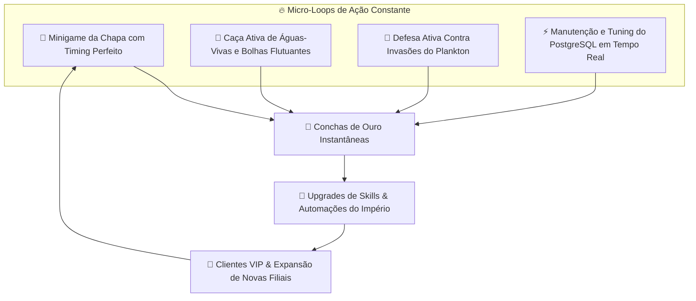

# 🍍 PRD: BIKINI BOTTOM TYCOON & POSTGRES EMPIRE (ACTIVE ACTION SIM)
## Documento de Requisitos de Produto (Product Requirements Document)

---

## 1. VISÃO GERAL DO PRODUTO (EXECUTIVE SUMMARY)

* **Nome do Projeto:** Siri Cascudo 2000: Bikini Bottom Action Tycoon & PostgreSQL Empire
* **Gênero:** Action Management Tycoon / Multi-Tasking Sim / RPG de Banco de Dados com Alto Fator Sensorial ("Juice")
* **Inspirações:** *Restaurant Tycoon 2 (Roblox), Work at a Pizza Place (Roblox), Overcooked, Dave the Diver, Pet Simulator 99, Cookie Clicker (apenas no fator sensorial)*
* **Plataforma:** JavaFX (JDK 25+) + PostgreSQL 16/17
* **Filosofia Central:** **Zero tédio, ação contínua e hiper-satisfação sensorial.** Não é um jogo de ficar parado esperando números subirem. O jogador está sempre em ação ativa: operando a chapa com timing perfeito, expulsando o Plankton da cozinha no clique, caçando águas-vivas douradas na tela, administrando o humor do Lula Molusco e otimizando queries no PostgreSQL para não deixar o banco travar no horário de pico do almoço!

---

## 2. ANÁLISE DE MERCADO: ENGENHARIA DE RETENÇÃO E "JUICE" EM JOGOS DO ROBLOX

### 2.1. Por que Clickers Puros Ficam Chatos e o que os Grandes Jogos do Roblox Fazem
Nossa pesquisa comparando jogos puramente ociosos (*idle/clicker*) com os maiores fenômenos de engajamento (*Restaurant Tycoon 2, Work at a Pizza Place, Pet Simulator 99*) revelou:
1. **O Problema do Idle Passivo:** Jogos onde o usuário apenas clica e espera perdem 70% da retenção após os primeiros 5 minutos porque o cérebro entra em tédio por falta de agência.
2. **O Segredo do "Active Multi-Tasking":** Os jogos mais viciantes do Roblox mantêm o jogador em um estado de **"Loop Caótico Divertido"**:
   * Sempre há 2 ou 3 micro-tarefas rápidas acontecendo simultaneamente.
   * O jogador escolhe prioridades: *"Viro o hambúrguer agora ou expulso o Plankton? O banco está com 80% de conexões ocupadas, preciso rodar um VACUUM rápido!"*
3. **O Fator "Satisfatório pra Caralho" (Sensory Juice):**
   * **Visual:** Números flutuantes elásticos estilo desenho animado com cores vibrantes (`+250 CONCHAS!`, `BURGER PERFEITO!`, `COMBO 7X!`).
   * **Sonoro:** Resposta de áudio com pitch variável (a cada hambúrguer seguido virado no tempo certo, o tom do som sobe, criando uma sensação musical de combo!).
   * **Físico/Tátil:** Elementos que reagem com física elástica (*squash and stretch*), sacudida de tela (*screen shake*) sutil em momentos de impacto e partículas de bolhas e fumaça dourada.

---

## 3. AS MECÂNICAS DE AÇÃO CONTÍNUA: SEMPRE ALGO PRA FAZER

### 3.1. Minigame Ativo da Chapa (Timing de Virada & Combos)
* Em vez de apenas clicar, o jogador tem a **Chapa do Siri Cascudo**:
  * O hambúrguer chia na grelha. Uma barra de ponto perfeito avança (Cru $\rightarrow$ No Ponto 🌟 $\rightarrow$ Queimado 💥).
  * Se o jogador clicar exatamente na zona verde ("No Ponto"), ganha **CRÍTICO + BÔNUS DE GORJETA**!
  * Acertos consecutivos constroem a barra de **COMBO DO BOB ESPONJA (2x, 3x, 5x, 10x de conchas)** com música acelerando e faíscas douradas.

### 3.2. Caça Ativa na Tela: Bolhas e Águas-Vivas Douradas
* Enquanto a loja roda, bolhas de sabão mágicas e águas-vivas passam flutuando pela tela em velocidades aleatórias.
* Estourar bolhas ou capturar uma água-viva concede conchas imediatas, buffs temporários (*Fritura Turbo 2x por 15s*) ou ingredientes secretos.

### 3.3. Invasões Surpresa do Plankton (Defesa da Cozinha)
* A cada 2 a 4 minutos, um alarme de emergência toca (`sponge-stank-noise.mp3`) com o Plankton tentando invadir a tela com uma mochila a jato ou disfarce.
* O jogador tem 5 segundos para clicar no Plankton repetidamente para esmagá-lo/arremessá-lo de volta para o Balde de Lixo!
* Se vencer: ganha uma recompensa de conchas do Seu Siriguejo.
* Se falhar: o Plankton rouba 10% do estoque do banco de dados!

### 3.4. O Desafio do DBA: Estresse e Afinação do PostgreSQL em Tempo Real
* Conforme o fluxo de clientes cresce, o sistema do Siri Cascudo acusa carga no banco de dados com indicadores visuais retrô:
  * **Uso de CPU do Servidor Fenda-DB:** Se atingir 90%, as mesas começam a reclamar da lentidão.
  * **Ações Ativas do Jogador:**
    * Clicar no botão `"⚡ EXPLAIN ANALYZE & OTIMIZAR"` para acelerar a fila.
    * Rodar `"🧹 AUTO-VACUUM MANUAL"` para limpar dados velhos e ganhar conchas bônus.
    * Ligar o `"🛡️ FIREWALL ANTI-INJECTION"` quando o Plankton tentar fraudar pedidos.

---

## 4. O SISTEMA DE PROGRESSÃO & SKILLS DO POSTGRESQL

As conchas de ouro acumuladas não ficam paradas; elas financiam a árvore de habilidades técnicas e operacionais:

| Tier | Habilidade / Skill | Efeito Prático no Jogo | Custo |
| :---: | :--- | :--- | :---: |
| **Tier 1** | **Espátula Hidrodinâmica Turbo** | Aumenta a zona de acerto perfeito da chapa em +50%. | 100 🐚 |
| **Tier 2** | **Índices B-Tree na Tabela `pedidos`** | Reduz o tempo de cozimento de todos os pratos em 35%. | 450 🐚 |
| **Tier 3** | **Connection Pool HikariCP** | Permite atender até 5 clientes simultâneos sem fila de espera. | 1.500 🐚 |
| **Tier 4** | **Contratação: Bob Esponja Automatizado** | Bob Esponja vira 1 hambúrguer a cada 3 segundos sozinho. | 5.000 🐚 |
| **Tier 5** | **Particionamento por Bairro da Fenda** | Libera entregas expressas para a Lagoa Goo e Domo da Sandy (+50% lucro). | 15.000 🐚 |
| **Tier 6** | **Sistema de Câmeras & Alarme Anti-Plankton** | Eletrocuta o Plankton automaticamente nas invasões. | 40.000 🐚 |
| **Tier 7** | **Replicação Master-Slave do Siri Cascudo** | Gera renda passiva mesmo com a janela em segundo plano. | 100.000 🐚 |

---

## 5. CORREÇÃO DE ARQUITETURA DE UI: SOBREPOSIÇÃO TOTAL DO BOB ESPONJA & GARY

### 5.1. GlassPane Global sem Restrições de Container
* Para resolver o problema de o Bob Esponja ficar atrás de botões ou preso dentro de caixas de layout:
  * Implementação de uma camada superior **`GlobalOverlayPane` (GlassPane)** transparente em todo o palco (`Stage`).
  * `imgBob` e `imgGary` passam a residir nessa camada superior absoluta com `toFront()`.
  * **Resultado:** O Bob Esponja pode ser pego pelo mouse em qualquer lugar da tela e arrastado por cima da tabela, por cima dos botões e descido até a pista de areia ao lado do Gary.
* **Mecânica da Guia de Passeio:**
  * Ao soltar o Bob Esponja próximo ao Gary, eles entram em modo `"Passeio em Dupla"`: o Bob segura a coleira imaginária do Gary e ambos caminham em sincronia ao som compassado de passos suaves na areia.

---

## 6. SISTEMA DE RESET DO BANCO & REBIRTH DO SIRIGUEJO

* **Opção 1: Reset Total de Emergência (Limpar Tudo):**
  * Botão acessível no menu: `"💥 Resetar Banco de Dados e Começar do Zero"`.
  * Trunca as tabelas `spongebob_items`, zera as conchas e limpa todo o inventário, permitindo que o usuário recomece com o banco 100% zerado e limpo.
* **Opção 2: Rebirth Corporativo do Seu Siriguejo (Prestige):**
  * Ao atingir a marca de faturamento do império, o Seu Siriguejo permite abrir uma **Nova Franquia**.
  * Reseta o banco e itens atuais, mas concede **Espátulas Douradas** permanentes que multiplicam permanentemente a velocidade de ganho de conchas.

---

## 7. CATÁLOGO MASSIVO DE ASSETS & IMAGENS (PARA IMERSÃO REALISTA)

### 7.1. Imagens de Fundo Cenográficas (Full HD / 4K)
* **`bg_siri_cascudo_salao.png`:** Salão de jantar clássico com mesas de barril de carvalho e chão de tábuas de navio naufragado.
* **`bg_cozinha_siri.png`:** A famosa cozinha com a grelha de ferro fundido, canos de navio e cofre embutido.
* **`bg_ceu_fenda_flores.jpg`:** O icônico céu azul-turquesa com flores submarinas desenhadas à mão (já integrado).
* **`bg_pista_areia_particulas.jpg`:** A areia da Fenda com pigmentos coloridos (já integrado).
* **`bg_balde_de_lixo.png`:** O laboratório sombrio do Plankton com Karen e tanques de chum.
* **`bg_domo_arvore.png`:** O interior ensolarado e verde do domo de ar comprimido da Sandy.

### 7.2. Sprites com Transparência Alfa 100% Perfeita
* **Bob Esponja:** Uniforme clássico com quepe de cozinheiro, animações de virar hambúrguer, pular e celebrar.
* **Gary o Caracol:** Versão normal, versão sorrindo e versão sem casca de vergonha.
* **Lula Molusco:** Caixa do restaurante entediado e versão tocando clarinete.
* **Patrícia / Patrick:** Disfarce de Patrícia e Patrick comendo comilanças.
* **Sr. Siriguejo:** Berrando com maços de dinheiro na mão.
* **Sandy Bochechas:** No traje espacial de mergulho pronta pro caratê.
* **Plankton & Karen:** No comando do laboratório de sabotagem.
* **Sra. Puff:** Em pose de estresse pré-explosão de baiacu.
* **Peixe Fred:** Com muletas e curativos gritando *"Minha perna!"*.

### 7.3. Efeitos Sonoros Oficiais Integrados
1. `sponge-stank-noise.mp3` - Buzina marítima de alarme e invasão do Plankton.
2. `gary_meow.mp3` - Miado satisfatório de recompensa e carinho.
3. `spongebob-walk.mp3` - Passo de borracha ritmado a cada 850ms.
4. `spongebob-boowomp.mp3` - Efeito cômico de cancelamento / erro.
5. `spongebob-fail.mp3` - Falha na chapa ou sabotagem.
6. `spongebob-sad-song.mp3` - Solo desafinado de clarinete do Lula Molusco.
7. `spongebob-shiver-sound.mp3` - Tremor de medo na confirmação de exclusão.

---

## 8. ESTRATÉGIA DE BRANCHES GIT

* **Branch `main`:** Permanece estritamente intacta com a versão original pura (tema escuro e código base limpo).
* **Branch `bob-esponja`:**
  * Já criada e isolada.
  * O script `./run.sh` executa automaticamente a versão temática do Bob Esponja por padrão.
  * Todo o desenvolvimento do império, minigames e skills do PostgreSQL continuará nesta branch.
